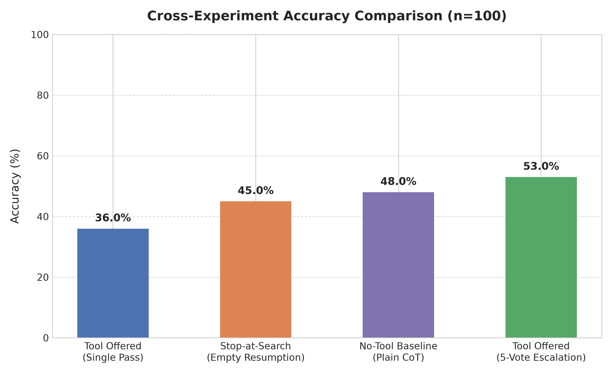
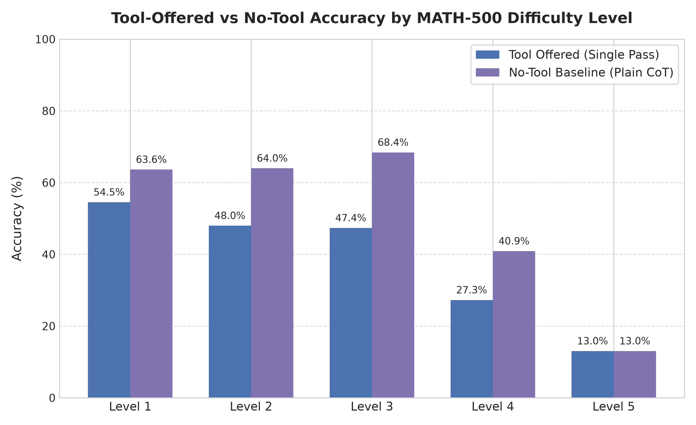

# Adaptive Retrieval Evaluation

## Quick Start

To reproduce or extend this evaluation:
1. Clone the repository: `git clone https://github.com/codewithabhiishek/Adaptive-retrieval-eval.git && cd Adaptive-retrieval-eval`
2. Install dependencies: `pip install -r requirements.txt`
3. Add your Groq API key to a `.env` file: `GROQ_API_KEY=your_key_here`
4. Run the benchmark pipeline: `python pipeline.py`
5. Generate visualization charts: `python make_charts.py`

## What this project is

This project replicates and tests a finding from a research paper by Sepp Hochreiter's lab (JKU Linz), titled "Adaptive Retrieval helps Reasoning in LLMs – but mostly if it's not used" (arXiv:2602.07213).

### The paper's core finding

The paper built an LLM agent (Llama-3.1-8B-Instruct) that can choose to emit a `<search>query</search>` tag mid-reasoning when solving math problems (GSM8K, MATH-500), pausing to retrieve external information before continuing.

Their key discovery: when the agent chose not to search, its accuracy was much higher than when it did search. It got 63.7% accuracy on MATH-500 when no search was used, but only around 29.4% correct on the retrieval-triggered subset (per their Table 5), which is actually worse than plain Chain-of-Thought on that same subset.

In other words: the model's own decision to search turns out to be a reliable signal of its confidence and difficulty. It's not, on its own, a reliable path to a correct answer.

## What we built

A "Metacognitive Router" pipeline that uses this decision (search vs. no-search) to route compute:

1. Run each problem through an agent using the paper's exact system prompt (Appendix A.2.5), which can emit `<search>` tags.
2. If the agent does not emit `<search>`, trust its answer directly (fast path, 1 API call, cheap).
3. If the agent does emit `<search>`, escalate: call the model 5 times with plain Chain-of-Thought at higher temperature, and take the majority-vote answer (expensive path, 5 API calls).

## The specific question we tested

The paper shows that the "search" decision reliably flags hard problems, and that skipping search is a strong confidence/correctness signal in their setup. We wanted to know whether that same pattern holds on a different, smaller-scale inference setup, and if not, what that tells us about how model-dependent this metacognitive behavior really is.

This shifted the project from its original cost-saving framing into a direct test of the paper's central claim, once early results showed the router behaving very differently than expected (see Results below).

## Tech stack (all free tier)

* Groq API (`llama-3.1-8b-instant`), free tier, used instead of self-hosted Llama-3.1-8B-Instruct (the paper's exact model) since we don't have GPU infra. This is a known deviation from the paper worth disclosing.
* Hugging Face `datasets` library to load `HuggingFaceH4/MATH-500` (500 math problems with ground-truth answers, difficulty levels 1-5)
* `sympy` for symbolic answer-checking, so `1/2` and `0.5` count as equal
* Plain Python, no ML training involved. This is an orchestration and evaluation project, not a model-training one.

## Important deviations from the paper (disclosed honestly)

* We are not implementing real retrieval (no FAISS index, no MathPile or OpenMathInstruct-2 corpus). When the model emits `<search>`, we treat that emission itself as the signal and don't inject real retrieved content. The model just continues reasoning.
* We use Groq's hosted `llama-3.1-8b-instant`, not a self-hosted Llama-3.1-8B-Instruct. This is likely a speed-optimized variant, not identical to the paper's model. Raw percentages don't match the paper's, and the pattern doesn't fully replicate either (see below).

## Files in this project

* `adaptive_agent.py`: core function that sends a problem through the paper's exact system prompt, detects the `<search>` tag, and extracts the `<answer>` tag (with fallback parsing for unclosed tags and `\boxed{}`)
* `checker.py`: sympy-based function to check if two math answers are equivalent (handles fractions, decimals, pi notation, algebraic expressions)
* `escalate.py`: self-consistency voting. For problems that triggered search, it calls the model 5x and takes the majority vote as the final answer
* `pipeline.py`: full pipeline tying agent, checker, and escalation together, looping over a problem set and logging results to CSV, with checkpoint/resume support and exponential backoff on rate limits
* `load_data.py`: confirms the MATH-500 dataset loads correctly
* `make_charts.py`: generates accuracy visualization charts from the results CSV
* `requirements.txt`: Python dependencies needed to run this project
* `COMPARISON.md`: a detailed paper-vs-replication comparison table
* `CASE_STUDIES.md`: illustrative examples of voting fixing or breaking individual answers
* `PROGRESS.md`: status tracker showing what's done and what's remaining
* `results/pilot_100_results.csv`: full structured results
* `results/raw_outputs.jsonl`: complete raw model reasoning for every problem, for full auditability
* `charts/`: accuracy visualizations
* `scratch/`: early exploratory and debug scripts, kept for transparency but not part of the core pipeline
* `.env`: holds `GROQ_API_KEY` and `HF_TOKEN` (not committed or shared)

## Results

### Setup deviation from paper (recap)
Groq `llama-3.1-8b-instant`, no real retrieval corpus, with `<search>` emission treated as the confidence signal itself.

### Full run: MATH-500 (n=100)

* **Search trigger rate: 98% (98/100).** Nearly every problem triggered search, including easy Level 1 problems.
* **No-search subset: 2 problems (2%).** Skipping search was a rare edge case rather than a common behavior. Of these 2 cases, 1 was correct and 1 was incorrect (50% no-search accuracy), consistent with the near-chance no-search accuracy also seen in our separate arithmetic calibration test (80% vs 82%, not a meaningfully large gap). This is too small a sample to draw strong conclusions from on its own, but it does not contradict the main finding: the paper's large no-search vs. search accuracy gap (63.7% vs 29.4%, +19.5pp) did not appear here in any of our tests.
* **Initial (single-shot) accuracy: 36.0% (36/100)**
* **Final accuracy after 5-vote majority escalation: 53.0% (53/100)**
* **Net boost from escalation: +17.0 percentage points**

*The "no-search" behavior central to the paper's finding occurred in only 2 out of 100 problems.*

By difficulty level:

| Level | n | Initial Accuracy | Final (5-vote) Accuracy | Gain |
|---|---|---|---|---|
| 1 (easiest) | 11 | 54.5% | 72.7% | +18.2pp |
| 2 | 25 | 48.0% | 68.0% | +20.0pp |
| 3 | 19 | 47.4% | 73.7% | +26.3pp |
| 4 | 22 | 27.3% | 45.5% | +18.2pp |
| 5 (hardest) | 23 | 13.0% | 17.4% | +4.3pp |

### Supporting evidence: simple arithmetic calibration test (n=100 across 3 runs; most reliable single run n=60)

* Search rate: 90-93% even on trivial arithmetic (e.g. "what is 2+2")
* No-search accuracy: 80% (4/5) in the 60-problem run
* Search accuracy: 82% (45/55) in the same run
* No-search and search accuracy were statistically indistinguishable, which is consistent with the MATH-500 pilot's finding that search-triggering isn't difficulty-discriminating in this setup.

### Interpretation

**Finding 1: the paper's core metacognitive signal doesn't replicate here.** The paper's central claim, that skipping retrieval signals confidence and correctness (63.7% no-search accuracy vs 44.2% CoT baseline, a +19.5pp gap), didn't hold in our setup. Skipping search occurred in only 2 out of 100 MATH-500 problems, and among those 2 cases accuracy was 50%, not meaningfully different from the search-subset accuracy. On a separate simple-arithmetic test, search-triggering similarly carried no meaningful accuracy signal (80% vs 82%). We verified this by hand, including a case where the model confidently answered "2+2=5" without triggering search at all.

**Finding 2: but self-consistency voting still delivers a large, genuine accuracy gain.** While the routing mechanism largely failed, since there was almost never a "cheap path" to route to, the underlying escalation technique of 5-vote majority voting improved accuracy from 36.0% to 53.0%, a +17.0pp gain. This held most strongly on medium-difficulty problems (Levels 2-3, +20 to +26pp) and was weakest on the hardest problems (Level 5, +4.3pp only), while easier problems (Levels 1-2) still saw solid double-digit gains.

### Follow-Up Experiments & Control Studies

To isolate the exact mechanisms behind the 98% search trigger rate and test tool distraction effects, we conducted two controlled follow-up experiments ($n=100$) and statistical significance testing:

1. **Stop-at-`</search>` Experiment:** Halting generation immediately upon emitting `</search>` (and resuming in a second turn with an empty search result prompt) yielded a **97.0% search trigger rate**, proving that over-triggering is driven by model/quantization factors rather than continuous generation dynamics. Resuming step-by-step reasoning after stopping reached **45.0% 2-turn post-resumption accuracy** (compared to 36.0% 1-turn continuous pass initial accuracy).
2. **No-Tool Baseline Experiment (Plain CoT):** Evaluating the exact same 100 problems with a plain Chain-of-Thought prompt (making **zero mention of tools**) yielded **48.0% accuracy** — demonstrating a **+12.0 percentage point tool distraction penalty** (36.0% vs 48.0%) caused purely by offering the search tool in the system prompt.
3. **Statistical Significance:** McNemar's paired binary test confirmed the +12.0pp accuracy gap between No-Tool CoT (48.0%) and Tool-Offered CoT (36.0%) is statistically significant ($p = 0.0118$, $\chi^2 = 6.05$, $95\%\text{ Bootstrap CI}: [+4.0\text{pp}, +20.0\text{pp}]$). Detailed statistical breakdowns are available in [SIGNIFICANCE_RESULTS.md](SIGNIFICANCE_RESULTS.md) and [NO_TOOL_COMPARISON.md](NO_TOOL_COMPARISON.md).

### Honest conclusion

The metacognitive "know when I don't know" signal identified in the paper appears to be model-dependent rather than a general property of adaptive-retrieval agents. Merely offering a search tool introduces a significant tool-distraction penalty (-12.0pp) on small hosted models by causing them to over-trigger search on problems they can already solve. However, self-consistency voting remains independently effective, recovering +17.0pp in accuracy regardless of whether the routing signal works.

## What "done" looks like

Two honest, evidenced findings instead of the original cost-savings framing: first, quantified evidence that the paper's metacognitive confidence signal doesn't transfer to this smaller, different inference setup, and second, quantified evidence that self-consistency voting alone delivers a substantial accuracy gain (+17.0pp) on this model, independent of the routing question.

---

For current project status and remaining work, see `PROGRESS.md`.